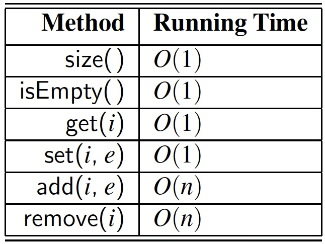

# Learning outcomes
1.   Understand and use List and Iterator ADTs
2.   Explain the (binary) tree structure and implementation
3.   Understand and apply tree traversal algorithms

# Readings

*   Chapter 7.1 - 7.5 & 8 of the textbook

# Workshop: List and Iterator ADTs and Trees

## Discussion

*   **[R-7.4]** Give a justification of the running times shown in Table 7.1 for the methods of an array list implemented with a (nonexpanding) array.

*   **[C-7.56]** When Bob wants to send Alice a message `M` on the Internet, he breaks `M` into `n` data packets, numbers the packets consecutively, and injects them into the network. When the packets arrive at Alice’s computer, they may be out of order, so Alice must assemble the sequence of `n` packets in order before she can be sure she has the entire message. Describe an efficient scheme for Alice to do this. What is the running time of this algorithm?

*   **[R-8.1]** The following questions refer to the tree of Figure 8.3.
    
    a. Which node is the root?
    
    b. What are the internal nodes?
    
    c. How many descendants does node cs016/ have?
    
    d. How many ancestors does node cs016/ have?
    
    e. What are the siblings of node homeworks/?
    
    f. Which nodes are in the subtree rooted at node projects/?
    
    g. What is the depth of node papers/?
    
    h. What is the height of the tree?

*   **[R-8.13]** Justify Table 8.2, summarizing the running time of the methods of a tree represented with a linked structure, by providing, for each method, a description of its implementation, and an analysis of its running time.

*   **[C-8.28]** The path length of a tree `T` is the sum of the depths of all positions in `T`. Describe a linear-time method for computing the path length of a tree T.

*   **[C-8.42]** Give an efficient algorithm that computes and prints, for every position `p` of a tree T, the element of `p` followed by the height of `p`’s subtree.

*   **[C-8.43]** Give an O(n)-time algorithm for computing the depths of all positions of a tree T, where n is the number of nodes of T.

*   **[C-8.46]** Describe, in pseudocode, a non-recursive method for performing an inorder traversal of a binary tree in linear time.

**Hint:** Use a stack.

*   **[C-8.55]** Let `T` be a tree with `n` positions. Define the lowest common ancestor (LCA) between two positions `p` and `q` as the lowest position in T that has both `p` and `q` as descendants (where we allow a position to be a descendant of itself ). Given two positions `p` and `q`, describe an efficient algorithm for finding the LCA of `p` and `q`. What is the running time of your algorithm?

**Hint:** It helps to know the relative depths of `p` and `q`.

## Implementation

* **[C-7.25]** Give an array-based list implementation, with fixed capacity, treating the array circularly so that it achieves O(1) time for insertions and removals *at index 0*, as well as insertions and removals *at the end of the array list*. Your implementation should also provide for a constant-time get method.

**Hint:** Think about how to extend the circular array implementation of the ***queue*** ADT given in the previous chapter.

*   **Task 1**.

