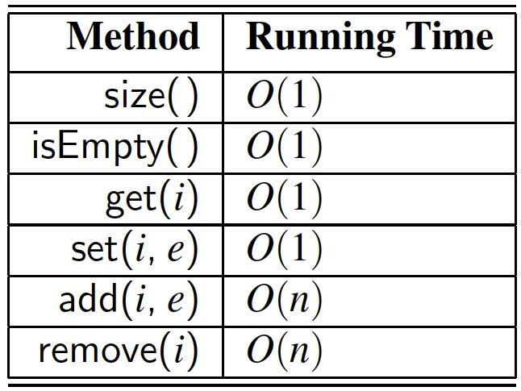
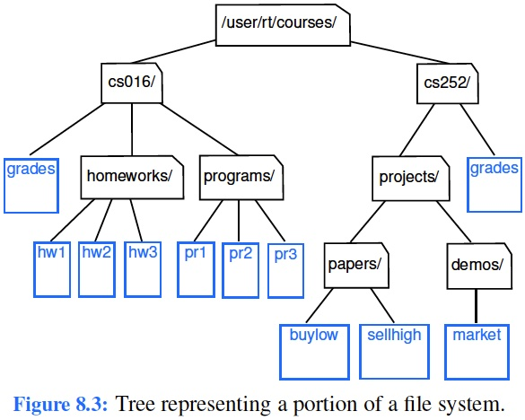
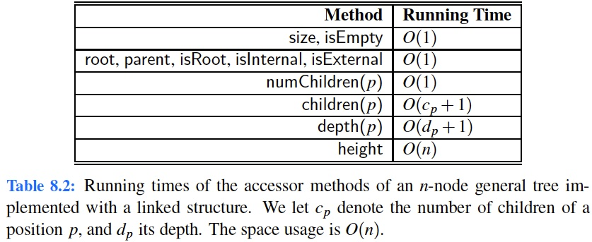

# Learning outcomes
1.   Understand and use List and Iterator ADTs
2.   Explain the (binary) tree structure and implementation
3.   Understand and apply tree traversal algorithms


# Readings

*   Chapter 7.1 - 7.5 & 8 of the textbook


# Workshop: List and Iterator ADTs and Trees


## Discussion

*   **[R-7.4]** Give a justification of the running times shown in Table 7.1 for the methods of an array list implemented with a (nonexpanding) array.




**Solution:** The methods `size()` and `isEmpty()` run in constant time because of the instance variable `n`. This variable can easily be returned or compared to give the results for these two methods. 

The method `get(i)` and `set(i, e)` is also constant because of the underlying array implementation of the array list. Since we are using an array, an access at a particular index is done with a simple `A[i]` reference. 

However, the methods `add(i, e)` and `remove(i)` take linear time due to the nature of an array. When inserting or deleting at certain index, we must shift other elements to ensure the sequential storage in the array. This can take up to `n` moves.


*   **[C-7.56]** When Bob wants to send Alice a message `M` on the Internet, he breaks `M` into `n` data packets, numbers the packets consecutively, and injects them into the network. When the packets arrive at Alice’s computer, they may be out of order, so Alice must assemble the sequence of `n` packets in order before she can be sure she has the entire message. Describe an efficient scheme for Alice to do this. What is the running time of this algorithm?

**Hint:** You should be able to achieve $O(n)$ time.


*   **[R-8.1]** The following questions refer to the tree of Figure 8.3.
    a. Which node is the root?
    b. What are the internal nodes?
    c. How many descendants does node cs016/ have?
    d. How many ancestors does node cs016/ have?
    e. What are the siblings of node homeworks/?
    f. Which nodes are in the subtree rooted at node projects/?
    g. What is the depth of node papers/?
    h. What is the height of the tree?




**Hint:** Be sure not to get confused between depth (which is for a single node) and height (which is for the entire tree).


*   **[R-8.13]** Justify Table 8.2, summarizing the running time of the methods of a tree represented with a linked structure, by providing, for each method, a description of its implementation, and an analysis of its running time.




**Hint:** Assume that the container of children is implemented as a positional list.
**Solution:** The `size()` and `isEmpty()` methods run in $O(1)$ assuming we maintain a top-level count of the number of nodes in the tree. 

The methods `root`, `parent`, `isRoot`, `isInternal`, `isExternal` are also constant since we need only to check local fields of the node or the tree’s root to determine these. 

The `numChildren` method is constant-time, because it is simply the size method of the secondary container of children. 

Reporting `children(p)` requires $O(c_p +1)$ time because it requires iterating through the entire collection of children (even if the container were empty). The analysis of `depth` and `height` were given in Section 8.1.3.


*   **[C-8.28]** The path length of a tree `T` is the sum of the depths of all positions in `T`. Describe a linear-time method for computing the path length of a tree T.

**Hint:** Modify an algorithm for computing the depth of each position so that it computes path lengths at the same time.


*   **[C-8.42]** Give an efficient algorithm that computes and prints, for every position `p` of a tree T, the element of `p` followed by the height of `p`’s subtree.

**Hint:** Use a tree traversal.
**Solution:** We can accomplish the task of printing the element stored at `p` along with the height of the subtree rooted at `p` by using a ***postorder*** traversal. During this traversal, we will find the height of each subtree. The height for a subtree at `p` will be 0 if `p` is a leaf and otherwise one more than the height of the max child. We can print out the element at `p` and its computed height during the postorder visit.


*   **[C-8.43]** Give an O(n)-time algorithm for computing the depths of all positions of a tree T, where n is the number of nodes of T.

**Hint:** Derive a formula that relates the depth of a position `p` to the depths of positions adjacent to `p`.
**Solution:** This can be done using a ***preorder*** traversal. When doing a “visit” in the traversal, simply store the depth of the position’s parent incremented by 1. Now, every node will contain its depth.


*   **[C-8.46]** Describe, in pseudocode, a non-recursive method for performing an inorder traversal of a binary tree in linear time.

**Hint:** Use a stack.

**Solution:**

```pseudocode
inorder(Tree T):
    Stack S = new Stack()
    Node v = T.root()
    push v
    while S is not empty do
        while v is internal do
            v = v.left
            push v
        while S is not empty do
            pop v
            visit v
            if v is internal then
                v = v.right
                push v
            while v is internal do
                v = v.left
                push v
```


*   **[C-8.55]** Let `T` be a tree with `n` positions. Define the lowest common ancestor (LCA) between two positions `p` and `q` as the lowest position in T that has both `p` and `q` as descendants (where we allow a position to be a descendant of itself ). Given two positions `p` and `q`, describe an efficient algorithm for finding the LCA of `p` and `q`. What is the running time of your algorithm?

**Hint:** It helps to know the relative depths of `p` and `q`.
**Solution:** The algorithm is given below.

```pseudocode
LCA(Node p, Node q):
    int pdpth = p.depth
    int qdpth = q.depth
    while pdpth > qdpth do
    	p = p.parent
    while qdpth > pdpth do
    	q = q.parent
    while p != q do
        p = p.parent
        q = q.parent
    return p
```


## Implementation

* **[C-7.25]** Give an array-based list implementation, with fixed capacity, treating the array circularly so that it achieves O(1) time for insertions and removals *at index 0*, as well as insertions and removals *at the end of the array list*. Your implementation should also provide for a constant-time get method.

**Hint:** Think about how to extend the circular array implementation of the ***queue*** ADT given in the previous chapter.
**Solution:** As we did with the `ArrayQueue` class, we recommend maintaining index `f` to the front of the list and size, which is the current number of elements. The element at index `k` in the list will be found at index `(f+k) % data.length` in the underlying data array. Insertions and removals can be processed at either end in constant time.


*   **Task 1**.

