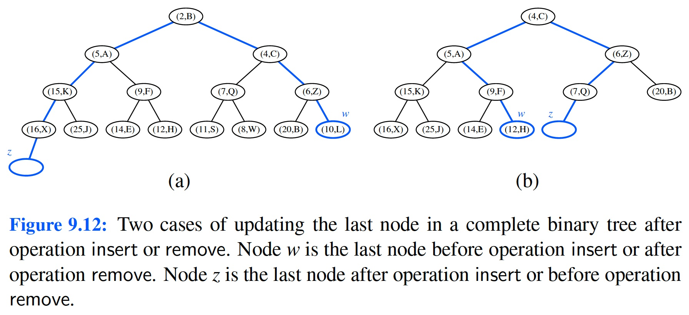

# Learning outcomes
1.   Understand and use sequence-based priority queues
2.   Understand and use heaps
3.   Explain and compare priority-based sorting algorithms
4.   Explain adaptable priority queues


# Readings

*   Chapter 9 of the textbook


# Workshop: Priority Queues


## Discussion

*   **[R-9.3]** What does each `removeMin` call return within the following sequence of priority queue ADT operations: `insert(5, A), insert(4, B), insert(7, F), insert(1, D), removeMin( ), insert(3, J), insert(6, L), removeMin( ), removeMin( ), insert(8, G), removeMin( ), insert(2, H), removeMin( ), removeMin( )`?

**Solution:** (1,D), (3,J), (4,B), (5,A), (2,H), (6,L).


*   **[R-9.10]** At which positions of a heap might the third smallest key be stored?

**Hint:** Where might the second smallest key be?

**Solution:** Level 1 or Level 2.

*   **[R-9.11]** At which positions of a heap might the largest key be stored?

**Solution:** The largest key in a heap may be stored at any external node.


*   **[R-9.12]** Consider a situation in which a user has numeric keys and wishes to have a priority queue that is maximum-oriented. How could a standard (min-oriented) priority queue be used for such a purpose?

**Solution:** The best way is to implement the Comparator interface with a reverse setting. That is,

```java
int compare(keyA, keyB) {
    if (keyA < keyB)
        return 1
    else if (keyA == keyB)
        return 0
    else
        return -1
```

 

*   **[R-9.13]** Illustrate the execution of the in-place heap-sort algorithm on the following input sequence: (2, 5, 16, 4, 10, 23, 39, 18, 26, 15).

**Hint:** Use a maximum-oriented heap.

**Solution:** Two phases: (1) insert elements one by one to construct a heap; and (2) removeMin to retrieve the smallest element one by one to generate the sorted list.

For in-place heap-sort, Phase (1) grows the heap array from left to right and Phase (2) construct the sorted listed from right to left because of the features of array-based heaps. Therefore, it's easier to use a maximum-oriented heap.

Phase 1: Construct the heap in-place from left to right. Maximum-oriented: the parent is equal or greater than its children.

(2	5	16	4	10	23	39	18	26	15)

2	(5	16	4	10	23	39	18	26	15)

5	2	(16	4	10	23	39	18	26	15)

16	2	5	(4	10	23	39	18	26	15)

16	4	5	2	(10	23	39	18	26	15)

16	10	5	2	4	(23	39	18	26	15)

23	10	16	2	4	5	(39	18	26	15)

39	10	23	2	4	5	16	(18	26	15)

39	18	23	10	4	5	16	2	(26	15)

39	26	23	18	4	5	16	2	10	(15)

39	26	23	18	15	5	16	2	10	4

Phase 2: remove the max and store it in the list (right to left)

39	26	23	18	15	5	16	2	10	4

26	18	23	10	15	5	16	2	4	(39)

23	18	16	10	15	5	4	2	(26	39)

18	15	16	10	2	5	4	(23	26	39)

16	15	5	10	2	4	(18	23	26	39)

15	10	5	4	2	(16	18	23	26	39)

10	4	5	2	(15	16	18	23	26	39)

5	4	2	(10	15	16	18	23	26	39)

4	2	(5	10	15	16	18	23	26	39)

2	(4	5	10	15	16	18	23	26	39)

(2	4	5	10	15	16	18	23	26	39)


*   **[C-9.25]** Show how to implement the stack ADT using only a priority queue and one additional integer instance variable.

**Hint:** Figure out a way to time stamp the entries in the priority queue.

**Solution:** Maintain a variable `m` initialized to `0`. On a `push` operation for element `e`, call `insert(m, e)` and decrement `m`. On a `pop` operation, call `remove` and increment `m`.


*   **[C-9.26]** Show how to implement the FIFO queue ADT using only a priority queue and one additional integer instance variable.

**Hint:** Figure out a way to time stamp the entries in the priority queue.

**Solution:** Maintain a `maxKey` variable initialized to `0`. On an `enqueue` operation for element `e`, call `insert(maxKey, e)` and increment `maxKey`. On a `dequeue` operation, call `removeMin`.


*   **[C-9.31]** Assume that we are using a linked representation of a complete binary tree `T`, and an extra reference to the last node of that tree. Show how to update the reference to the last node after operations `insert` or `remove` in $O(\log n)$ time, where `n` is the current number of nodes of `T`. Be sure to handle all possible cases, as illustrated in Figure 9.12.



**Hint:** Do simple up-and-down searches in the tree to locate the last node each time.

**Solution:**

```java
/**
* Utility called just after insert has been called. It updates 'last'
* reference to be an external node of a proper binary tree to expand.
*/
private Position<E> findInsertionPosition( ) {
    Position<E> z; // desired insertion position
    if (isEmpty( )) {
    	z = root( );
    } else {
        z = last; // assumed reference to current last position
        while (!isRoot(z) && z == right(parent(z)))
        	z = parent(z); // walk upward
        if (!isRoot(z))
        	z = right(parent(z)); // then go to right sibling
        while (!isExternal(z)) // and finally
        	z = left(z); // find leftmost internal node in subtree
    }
    return z;
}
```


*   **[C-9.40]** Explain how the `k` largest elements from an unordered collection of size `n` can be found in time $O(n\log k)$ using $O(k)$ auxiliary space.

**Hint:** Process elements one at a time, always storing the largest `k` that you have seen.
**Solution:** Maintain a minimum-oriented heap with maximum size `k`. Start by inserting the first `k` numbers, and from that point on, if the next number is greater than the smallest number in the heap, then remove the smallest number and then insert the new number. There will be at most $2n$ heap operations, each of which takes $O(\log k)$ time since the heap has at most `k` entries.


## Implementation

* **[C-9.48]*** An online computer system for trading stocks needs to process orders of the form “buy 100 shares at `$x` each” or “sell 100 shares at `$y` each.” A buy order for `$x` can only be processed if there is an existing sell order with price `$y` such that $y \leq x$. Likewise, a sell order for `$y` can only be processed if there is an existing buy order with price `$x` such that $y \leq x$. If a buy or sell order is entered but cannot be processed, it must wait for a future order that allows it to be processed. Describe a scheme that allows buy and sell orders to be entered in $O(\log n)$ time, independent of whether or not they can be immediately processed. Then write a program that can process a sequence of stock buy and sell orders.


*   **Task 1**.

