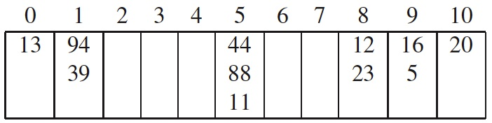
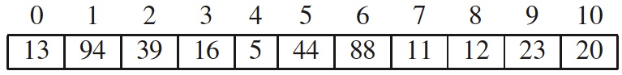
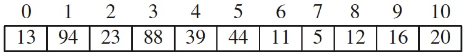
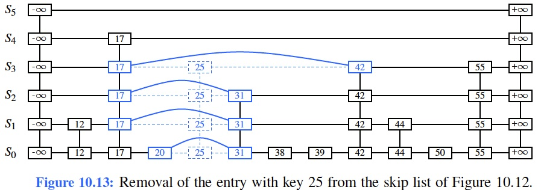

# Learning outcomes
1.   Explain and use Maps
2.   Explain and use Hash Tables
3.   Explain and use Skip Lists
4.   Know the concepts of Sets, Multisets, and Multimaps

# Readings

*   Chapter 10 of the textbook

# Workshop: Maps, Hash Tables, and Skip Lists

## Discussion

*   **[R-10.6]** Draw the 11-entry hash table that results from using the hash function, $h(i) = (3i+5) \mod 11$, to hash the keys 12, 44, 13, 88, 23, 94, 11, 39, 20, 16, and 5, assuming collisions are handled by chaining.

If you are interest, play with the online animation tool: <https://visualgo.net/en/hashtable>

**Solution:**

* **[R-10.7]** What is the result of the previous exercise, assuming collisions are handled by linear probing?

If you are interest, play with the online animation tool: <https://visualgo.net/en/hashtable>

**Solution:**

* **[R-10.9]** What is the result of Exercise R-10.6 when collisions are handled by double hashing using the secondary hash function $h′(k) = 7−(k \mod 7)$?

If you are interest, play with the online animation tool: <https://visualgo.net/en/hashtable>

**Solution:**

* **[R-10.17]** Explain why a hash table is not suited to implement a sorted map.

**Hint:** Think of where the entry with minimum key is stored.

* **[R-10.23]** Draw the result after performing the following series of operations on the skip list shown in Figure 10.13: `remove(38), put(48, x), put(24, y), remove(55)`. Use an actual coin flip to generate random bits as needed (and report your sequence of flips).

**Hint:** Mimic the style of the figures in the book. Try the online Skip List animation tool: <https://people.ok.ubc.ca/ylucet/DS/SkipList.html>

* **[C-10.54]** Given a database `D` of `n` cost-performance pairs `(c, p)`, describe an algorithm for finding the maxima pairs of `C` in $O(n\log n)$ time. 

**Hint:** [Read this article for the concept of Maxima of a point set](https://en.wikipedia.org/wiki/Maxima_of_a_point_set)

**Solution:** Sort the pairs by cost. Then scan this list looking at the performance values. Remove any that have performance values worse than the (unremoved) pair that came before.

* **[C-10.58]** Suppose that each row of an $n×n$ array `A` consists of 1’s and 0’s such that, in any row of `A`, all the 1’s come before any 0’s in that row. Assuming `A` is already in memory, describe a method running in $O(n\log n)$ time (not $O(n^2)$ time) for counting the number of 1’s in `A`.

**Hint:** Think first about how you can determine the number of 1’s in any row in $O(log n)$ time.
**Solution:** To count the number of 1’s in `A`, we can do a binary search on each row of A to determine the position of the last 1 in that row. Then we can simply sum up these values to obtain the total number of 1’s in `A`. This takes $O(\log n)$ time to find the last 1 in each row. Done for each of the `n` rows, then this takes $O(n\log n)$ time.

## Implementation

* **Task 1**.

