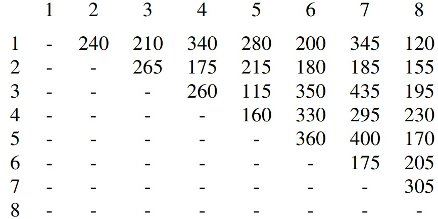

# Learning outcomes
1.   Explain concepts related to directed graphs
2.   Apply the Dijkstra’s Algorithm to find shortest paths
3.   Apply Prim-Jarnik and Kruskal algorithm to find the minimum spanning tree

# Readings

*   Chapter 14.5-14.7 of the textbook

# Workshop: Graphs (II)

## Discussion

*   **[R-14.17]** Bob loves foreign languages and wants to plan his course schedule for the following years. He is interested in the following nine language courses: LA15, LA16, LA22, LA31, LA32, LA126, LA127, LA141, and LA169. The course  prerequisites are:
    *   LA15: (none)
    *   LA16: LA15
    *   LA22: (none)
    *   LA31: LA15
    *   LA32: LA16, LA31
    *   LA126: LA22, LA32
    *   LA127: LA16
    *   LA141: LA22, LA16
    *   LA169: LA32

In what order can Bob take these courses, respecting the prerequisites?  

* **[R-14.27*]** There are eight small islands in a lake, and the state wants to build seven bridges to connect them so that each island can be reached from any other one via one or more bridges. The cost of constructing a bridge is proportional to its length. The distances between pairs of islands are given in the following table.

Give 2 solutions to decide which bridges to build to minimize the total construction cost.

 

* **[C-14.67]** Consider a diagram of a telephone network, which is a graph `G` whose vertices represent switching centers, and whose edges represent communication lines joining pairs of centers. Edges are marked by their bandwidth, and the bandwidth of a path is equal to the lowest bandwidth among the path’s edges. Give an algorithm that, given a network and two switching centers `a` and `b`, outputs the maximum bandwidth of a path between `a` and `b`.

## Implementation

* **Task 2 assignment**.

