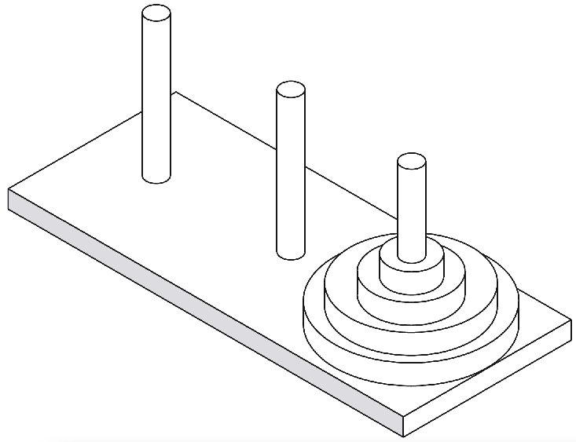

# Workshop: Recursion, Stacks, and Queues

## Discussion

*   **[R-5.1]** Describe a recursive algorithm for finding the maximum element in an array, A, of n elements. What is your running time and space usage?

**Hint:** Don’t forget about the space used by the method stack.
**Solution:** If the array has 1 element, that is the maximum. Otherwise, consider the bigger of the first element or the maximum of the other n−1 elements. The running time and space usages is $O(n)$.


*   **[R-5.10]** Describe a way to use recursion to compute the sum of all the elements in an $n \times n$ (two-dimensional) array of integers.

**Hint:** You can use two recursive methods that look like Binary-Sum. E.g. Sum half of columns in 1 recursive call.

Alternatively, reduce n by 1 in each iteration with linear recursive method.


*   **[C-5.12]** Describe an efficient recursive algorithm for solving the element uniqueness problem, which runs in time that is at most $O(n^2)$ in the worst case without using sorting.

**Solution:** 

When $n=1$​, it's unique. Assume the colleciton is unique when $n=k$​​, expand it to $n= k+1$​, we only need to compare the new item with existing unique collection to see if there's any match.

Alternatively, decompose $n$​ items into (n-1) collection and 1 item. The last item should be different from each item in the (n-1) collection.


*   **[C-5.16]** In the Towers of Hanoi puzzle, we are given a platform with three pegs, `a`, `b`, and `c`, sticking out of it. On peg `a` is a stack of `n` disks, each larger than the next, so that the smallest is on the top and the largest is on the bottom. The puzzle is to move all the disks from peg `a` to peg `c`, moving one disk at a time, so that we never place a larger disk on top of a smaller one. See Figure 5.15 for an example of the case $n = 4$​​​. Describe a recursive algorithm for solving the Towers of Hanoi puzzle for arbitrary `n`. (Hint: Consider first the subproblem of moving all but the $n^{th}$​ disk from peg `a` to another peg using the third as “temporary storage.”)



**Hint:** Consider first the subproblem of moving all but the $n^th$ disk from peg a to another peg using the third as “temporary storage.”

Define a method `move(n, source, target, temp)` which moves `n` disks from source pole to target pole with the help of temp pole.

To achive this, move() does 3 steps:

1.    Move n-1 disk from source to temp with the help of target
2.   Move the only ($n^{th}$) disk on source to the target
3.   Move (n-1) disks from temp to target with the help of source

That is: 

```pseudocode
fun move(n, source, target, temp) {
	move(n-1, source, temp, target)
	move 1 disk from source to target
	move(n-1, temp, target, source)
}
```

The minimal number of moves required to solve a Tower of Hanoi puzzle is $2^n − 1$

A good explanation to Hanoi puzzle can be found here: <https://www.youtube.com/watch?v=rf6uf3jNjbo>

*   **[C-5.21]** Given an unsorted array, `A`, of integers and an integer `k`, describe a recursive algorithm for rearranging the elements in `A` so that all elements less than or equal to `k` come before any elements larger than `k`. What is the running time of your algorithm on an array of `n` values?

**Hint:** Begin by comparing the first and last elements in a range of indices in A.

```pseudocode
void organize(int[ ] data, int low, int high) {
	if (low < high) {
		if (data[high] > k) { 
			organize(data, low, high−1); // do nothing and reduce size by 1
		} else {						 // data[high] should be in the first part
            int temp = data[high];		 // swap data[high] and data[low]
            data[high] = data[low];
            data[low] = temp;
            organize(data, low+1, high); 
        }
    }
}
void organize(int[ ] data) {
organize(data, 0, data.length − 1);
}
```

Time complexity is $O(n)$​ as we iterate through the array


*   **[C-5.22]** Suppose you are given an array, `A`, containing `n` distinct integers that are listed in increasing order. Given a number `k`, describe a recursive algorithm to find two integers in `A` that sum to `k`, if such a pair exists. What is the running time of your algorithm?

**Hint:** The beginning and the end of a range of indices in A can be used as arguments to your recursive method.
**Solution:** The solution makes use of the method `FindPair(A, i, j,k)`, which given the sorted subarray A[i.. j] determines whether there is any pair of elements that sums to `k`. Three cases:

*   A[i]+A[j] < k. Because A is sorted and we use the largest possible A[j], the solution is to consider the remaining subarray A[i+ 1.. j]. 
*   A[i]+A[j] > k, Because A is sorted and we use the smallest possible A[i], the solution is to consider the remaining subarray A[i.. j−1]. 
*   A[i]+A[ j] = k and we return true. 

If no such pair is ever found, eventually all but one element is eliminated (i = j), and we return false.

```pseudocode
FindPair(A, i, j,k):
    if i == j then
    	return false
    else
        if A[i]+A[j] < k then
        	return FindPair(A, i+1, j,k)
        else if A[i]+A[j] > k then
        		return FindPair(A, i, j−1,k)
        else
        	return true
```

Time complexity is $O(n)$ as we iterate through the array


*   **[R-6.1]** Suppose an initially empty stack `S` has performed a total of 25 push operations, 12 top operations, and 10 pop operations, 3 of which returned `null` to indicate an empty stack. What is the current size of `S`?

**Hint:** If a stack is empty when pop is called, its size does not change.

**Solution:** The size of the stack is 25−10+3 = 18.


*   **[R-6.3]** What values are returned during the following series of stack operations, if executed upon an initially empty stack? push(5), push(3), pop(), push(2), push(8), pop(), pop(), push(9), push(1), pop(), push(7), push(6), pop(), pop(), push(4), pop(), pop().

**Hint:** Use a paper and pencil with eraser to simulate the stack.
**Solution:** 3, 8, 2, 1, 6, 7, 4, 9


*   **[R-6.7]** Suppose an initially empty queue `Q` has performed a total of 32 enqueue operations, 10 first operations, and 15 dequeue operations, 5 of which returned null to indicate an empty queue. What is the current size of Q?

**Hint:** If a queue is empty when dequeue is called, its size does not change.
**Solution:** The size of the queue is 32−15+5 = 22.


*   **[R-6.9]** What values are returned during the following sequence of queue operations, if executed on an initially empty queue? enqueue(5), enqueue(3), dequeue(), enqueue(2), enqueue(8), dequeue(), dequeue(), enqueue(9), enqueue(1), dequeue(), enqueue(7), enqueue(6), dequeue(), dequeue(), enqueue(4), dequeue(), dequeue().

**Hint:** Use a paper and pencil with eraser to simulate the queue.
**Solution:** 5, 3, 2, 8, 9, 1, 7, 6


*   **[C-6.20]** Suppose you have three nonempty stacks `R`, `S`, and `T`. Describe a sequence of operations that results in `S` storing all elements originally in `T` below all of `S`’s original elements, with both sets of those elements in their original order. The final configuration for `R` should be the same as its original configuration. For example, if `R = (1,2,3), S = (4,5)`, and `T = (6,7,8,9)`, when ordered from bottom to top, then the final configuration should have `R = (1,2,3)` and `S = (6,7,8,9,4,5)`.

**Hint:** You can still use R as temporary storage, as long as you never pop its original contents.
**Solution:** Let r, s and t denote the original sizes of the stacks.
Make s calls to R.push(S.pop( ))
Make t calls to R.push(T.pop( ))
Make s+t calls to S.push(R.pop( ))


*   **[C-6.24]** Suppose you have a stack `S` containing `n` elements and a queue `Q` that is initially empty. Describe how you can use `Q` to scan `S` to see if it contains a certain element `x`, with the additional constraint that your algorithm must return the elements back to `S` in their original order. You may only use `S`, `Q`, and a constant number of other primitive variables.

**Hint:** Think of how you might use Q to process the elements of S twice.
**Solution:** The solution is to actually use the queue Q to process the elements in two phases. In the first phase, we iteratively pop each the element from S and enqueue it in Q, and then we iteratively dequeue each element from Q and push it into S. This reverses the elements in S. Then we repeat this same process, but this time we also look for the element x. By passing the elements through Q and back to S a second time, we reverse the reversal, thereby putting the elements back into S in their original order.


## Implementation

* **[C-5.18]** Write a short recursive Java method that determines if a string `s` is a palindrome, that is, it is equal to its reverse. Examples of palindromes include 'racecar' and 'gohangasalamiimalasagnahog'.

**Hint:** Check the equality of the first and last characters and recur (but be careful to return the correct value for both odd- and even-length strings).


*   **[P-5.30]** Write a program that can solve instances of the Tower of Hanoi problem (from Exercise C-5.16).

**Hint:** Note the recursive nature of the problem.


*   **[C-6.18]** In Code Fragment 6.8 we assume that opening tags in HTML have form `<name>`, as with `<li>`. More generally, HTML allows optional attributes to be expressed as part of an opening tag. The general form used for expressing an attribute is `<name attribute1="value1" attribute2="value2">`; for example, a table can be given a border and additional padding by using an opening tag of `<table border="3" cellpadding="5">`. Modify Code Fragment 6.8 so that it can properly match tags, even when an opening tag may include one or more such attributes.

**Hint:** After finding what’s between the < and > characters, the tag is only the part before the first space (if any).


*   **[P-6.36]** When a share of common stock of some company is sold, the capital gain (or, sometimes, loss) is the difference between the share’s selling price and the price originally paid to buy it. This rule is easy to understand for a single share, but if we sell multiple shares of stock bought over a long period of time, then we must identify the shares actually being sold. A standard accounting principle for identifying which shares of a stock were sold in such a case is to use a FIFO protocol—the shares sold are the ones that have been held the longest (indeed, this is the default method built into several personal finance software packages). For example, suppose we buy 100 shares at `$20` each on day 1, 20 shares at `$24` on day 2, 200 shares at `$36` on day 3, and then sell 150 shares on day 4 at `$30` each. Then applying the FIFO protocol means that of the 150 shares sold, 100 were bought on day 1, 20 were bought on day 2, and 30 were bought on day 3. The capital gain in this case would therefore be $100 \times 10 + 20 \times 6 + 30 \times (-6)$​​, or `$940`. Write a program that takes as input a sequence of transactions of the form “buy `x` share(s) at `$y` each” or “sell `x` share(s) at `$y` each,” assuming that the transactions occur on consecutive days and the values `x` and `y` are integers. Given this input sequence, the output should be the total capital gain (or loss) for the entire sequence, using the FIFO protocol to identify shares.

**Hint:** Define two stacks that are used match sell orders with buy orders.
