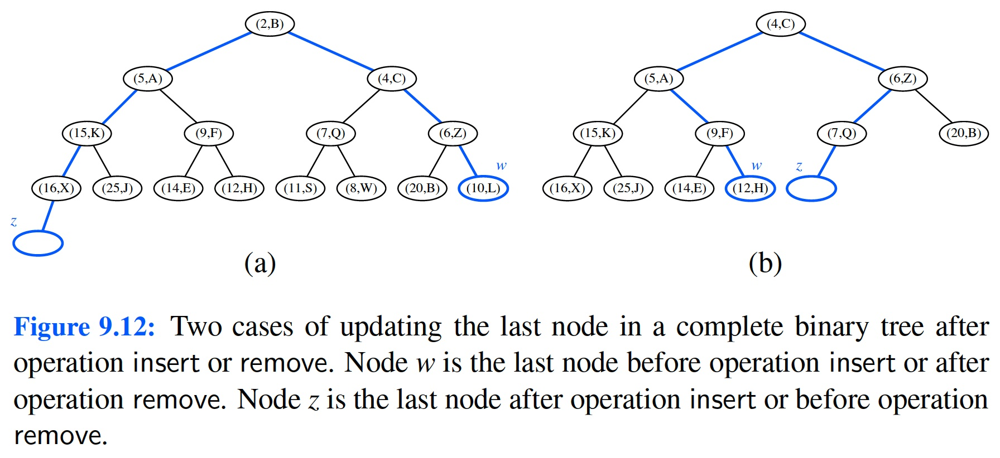

# Learning outcomes
1.   Understand and use sequence-based priority queues
2.   Understand and use heaps
3.   Explain and compare priority-based sorting algorithms
4.   Explain adaptable priority queues

# Readings

*   Chapter 9 of the textbook

# Workshop: Priority Queues

## Discussion

*   **[R-9.3]** What does each `removeMin` call return within the following sequence of priority queue ADT operations: `insert(5, A), insert(4, B), insert(7, F), insert(1, D), removeMin( ), insert(3, J), insert(6, L), removeMin( ), removeMin( ), insert(8, G), removeMin( ), insert(2, H), removeMin( ), removeMin( )`?

**Hint:** You're welcome to use this animated tool to trace the execution: <https://www.cs.usfca.edu/~galles/JavascriptVisual/Heap.html>

*   **[R-9.10]** At which positions of a heap might the third smallest key be stored?

*   **[R-9.11]** At which positions of a heap might the largest key be stored?

*   **[R-9.12]** Consider a situation in which a user has numeric keys and wishes to have a priority queue that is maximum-oriented. How could a standard (min-oriented) priority queue be used for such a purpose?

 

*   **[R-9.13]** Illustrate the execution of the in-place heap-sort algorithm on the following input sequence: (2, 5, 16, 4, 10, 23, 39, 18, 26, 15).

**Hint:** Use a maximum-oriented heap. You're welcome to use this animated tool to trace the execution: <https://visualgo.net/en/heap>

*   **[C-9.25]** Show how to implement the stack ADT using only a priority queue and one additional integer instance variable.

*   **[C-9.26]** Show how to implement the FIFO queue ADT using only a priority queue and one additional integer instance variable.

*   **[C-9.31]** Assume that we are using a linked representation of a complete binary tree `T`, and an extra reference to the last node of that tree. Show how to update the reference to the last node after operations `insert` or `remove` in $O(\log n)$ time, where `n` is the current number of nodes of `T`. Be sure to handle all possible cases, as illustrated in Figure 9.12.

*   **[C-9.40]** Explain how the `k` largest elements from an unordered collection of size `n` can be found in time $O(n\log k)$ using $O(k)$ auxiliary space.

## Implementation

* **[C-9.48]*** An online computer system for trading stocks needs to process orders of the form “buy 100 shares at `$x` each” or “sell 100 shares at `$y` each.” A buy order for `$x` can only be processed if there is an existing sell order with price `$y` such that $y \leq x$. Likewise, a sell order for `$y` can only be processed if there is an existing buy order with price `$x` such that $y \leq x$. If a buy or sell order is entered but cannot be processed, it must wait for a future order that allows it to be processed. Describe a scheme that allows buy and sell orders to be entered in $O(\log n)$ time, independent of whether or not they can be immediately processed. Then write a program that can process a sequence of stock buy and sell orders.

*   **Task 1**.

