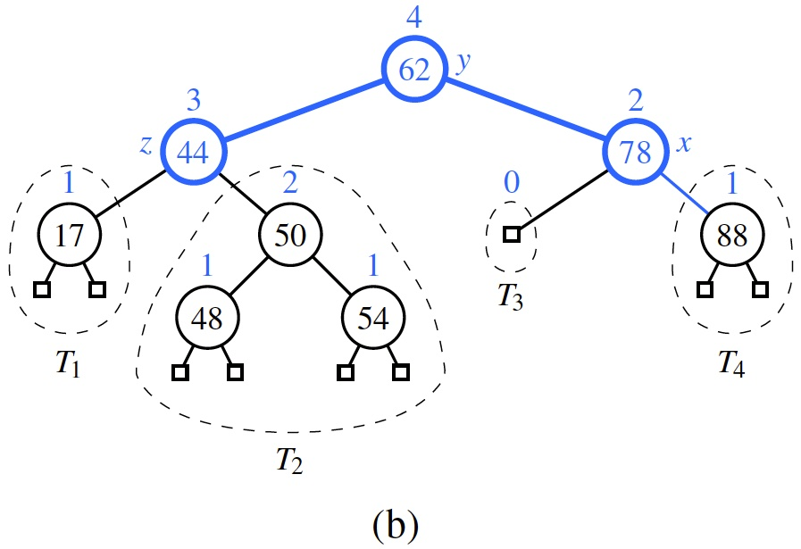

# Learning outcomes
1.   Explain the concept of binary search trees
2.   Explain the operations in AVL trees
3.   Explain the operations in (2,4) trees
4.   Use AVL and (2, 4) trees

# Readings

*   Chapter 11.1, 11.2, 11.3, and 11.5 of the textbook

# Workshop: Search Trees

## Discussion

* **[R-11.1]** If we insert the entries (1,A), (2,B), (3,C), (4,D), and (5,E), in this order, into an initially empty binary search tree, what will it look like?

If you are interest, play with the online animation tool: <https://visualgo.net/en/bst>

* **[R-11.2]** Insert, into an empty binary search tree, entries with keys 30, 40, 24, 58, 48, 26, 11, 13 (in this order). Draw the tree after each insertion.

If you are interest, play with the online animation tool: <https://visualgo.net/en/bst>

* **[R-11.5]** Dr. Amongus claims that the order in which a fixed set of entries is inserted into an AVL tree does not matter—the same AVL tree results every time. Give a small example that proves he is wrong.

**Hint:** Consider the following 2 input sequences: 9,5,12,7,13 and 9,7,12,5,13

* **[R-11.8]** Draw the AVL tree resulting from the insertion of an entry with key 52 into the AVL tree of Figure 11.13b.

If you are interest, play with the online animation tool: <https://visualgo.net/en/bst>

* **[R-11.9]** Draw the AVL tree resulting from the removal of the entry with key 62 from the AVL tree of Figure 11.13b.

* **[R-11.17]** Is the search tree of Figure 11.22(a) a (2,4) tree? Why or why not?

* **[R-11.19]** Dr. Amongus claims that a (2,4) tree storing a set of entries will always have the same structure, regardless of the order in which the entries are inserted. Show that he is wrong.

**Hint:** You will need at list five entries to find a counter example. Consider the following 2 input sequences: 4, 6, 12, 15, 3, 5 and 12, 3, 6, 4, 5, 15

* **[C-11.29*]** Explain how to use an AVL tree to sort `n` comparable elements in $O(n \log n)$ time in the worst case.

