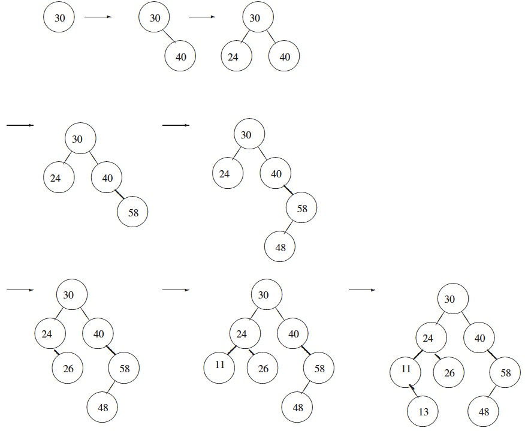
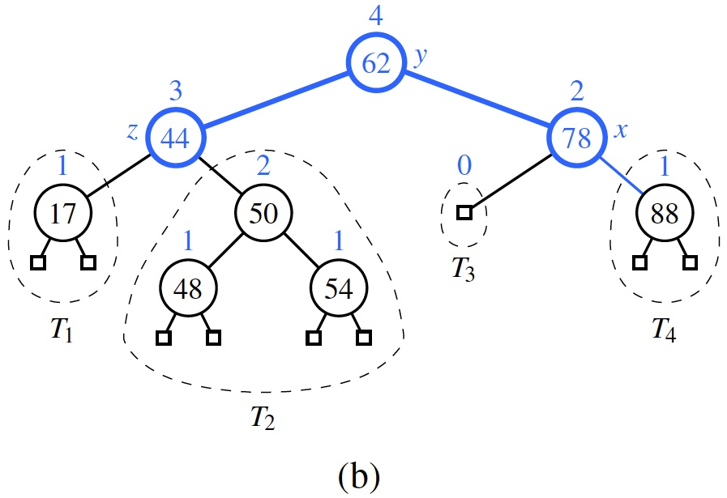
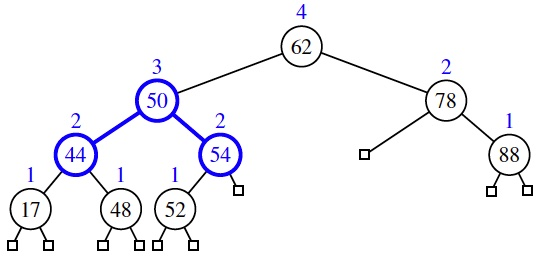
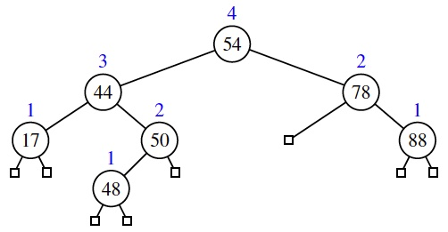
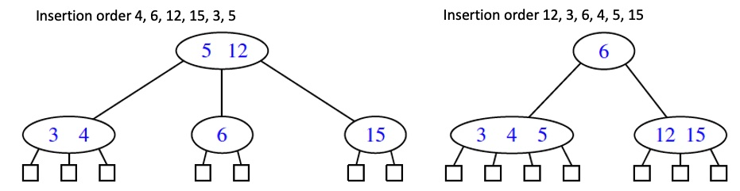

# Learning outcomes
1.   Explain the concept of binary search trees
2.   Explain the operations in AVL trees
3.   Explain the operations in (2,4) trees
4.   Use AVL and (2, 4) trees

# Readings

*   Chapter 11.1, 11.2, 11.3, and 11.5 of the textbook

# Workshop: Search Trees

## Discussion

* **[R-11.1]** If we insert the entries (1,A), (2,B), (3,C), (4,D), and (5,E), in this order, into an initially empty binary search tree, what will it look like?

If you are interest, play with the online animation tool: <https://visualgo.net/en/bst>

**Solution:** A string of 1 - 5.

* **[R-11.2]** Insert, into an empty binary search tree, entries with keys 30, 40, 24, 58, 48, 26, 11, 13 (in this order). Draw the tree after each insertion.

If you are interest, play with the online animation tool: <https://visualgo.net/en/bst>

**Solution:** 

* **[R-11.5]** Dr. Amongus claims that the order in which a fixed set of entries is inserted into an AVL tree does not matter—the same AVL tree results every time. Give a small example that proves he is wrong.

**Hint:** Consider the following 2 input sequences: 9,5,12,7,13 and 9,7,12,5,13

* **[R-11.8]** Draw the AVL tree resulting from the insertion of an entry with key 52 into the AVL tree of Figure 11.13b.

If you are interest, play with the online animation tool: <https://visualgo.net/en/bst>

**Solution:** The updated tree follows. The highlighted nodes (44,50,54) were involved in a trinode restructuring.

* **[R-11.9]** Draw the AVL tree resulting from the removal of the entry with key 62 from the AVL tree of Figure 11.13b.

**Solution:** The updated tree follows. Not much has changed, as by our implementation, the root node takes on value 54 (the max of the left subtree), and then the node that had held 54 is removed; however, no imbalance results from that deletion. (A more significant change would have occurred had the minimum value from the right subtree been used as a replacement for 62.)

* **[R-11.17]** Is the search tree of Figure 11.22(a) a (2,4) tree? Why or why not?

**Solution:** No. One property of a (2,4) tree is that all external nodes are at the same depth. The multiway search tree of the example does not adhere to this property.

* **[R-11.19]** Dr. Amongus claims that a (2,4) tree storing a set of entries will always have the same structure, regardless of the order in which the entries are inserted. Show that he is wrong.

**Hint:** You will need at list five entries to find a counter example. Consider the following 2 input sequences: 4, 6, 12, 15, 3, 5 and 12, 3, 6, 4, 5, 15

* **[C-11.29*]** Explain how to use an AVL tree to sort `n` comparable elements in $O(n \log n)$ time in the worst case.

**Hint:** The method is similar to priority-queue sorting.

## Implementation

* **[C-11.37]** Suppose we wish to support a new method `countRange(k1, k2)` that determines how many keys of a sorted map fall in the specified range. We could clearly implement this in $O(s + h)$ time by adapting our approach to `subMap`. Describe how to modify the search-tree structure to support $O(h)$ worst-case time for `countRange`.

**Hint:** Note that this method returns a single integer, so it is not necessary to visit all s entries that lie in the range. You will need to extend the tree data structure, adding a new field to each node.

