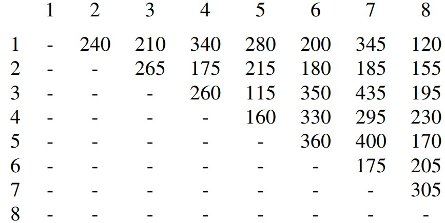

# Learning outcomes
1.   Explain concepts related to directed graphs
2.   Apply the Dijkstra’s Algorithm to find shortest paths
3.   Apply Prim-Jarnik and Kruskal algorithm to find the minimum spanning tree


# Readings

*   Chapter 14.5-14.7 of the textbook


# Workshop: Graphs (II)

## Discussion

*   **[R-14.17]** Bob loves foreign languages and wants to plan his course schedule for the following years. He is interested in the following nine language courses: LA15, LA16, LA22, LA31, LA32, LA126, LA127, LA141, and LA169. The course  prerequisites are:
    *   LA15: (none)
    *   LA16: LA15
    *   LA22: (none)
    *   LA31: LA15
    *   LA32: LA16, LA31
    *   LA126: LA22, LA32
    *   LA127: LA16
    *   LA141: LA22, LA16
    *   LA169: LA32

In what order can Bob take these courses, respecting the prerequisites?  

**Solution:** The topological sorting algorithm can help us solve this problem.

* Build a directed graph to represent the course prerequisite requirements. The nine courses are vertices in the directed graph. If a course `A` is a prerequisite for another course `B`, the directed graph has a directed edge from `A` to `B`.
* Apply the topological sorting algorithm on this directed graph. The result is one possible sequence of courses for Bob.

For the given set of prerequisites, the solution is not unique. For example, one possible solution is LA15, LA16, LA22, LA31, LA32, LA126, LA127, LA141, LA169. Another solution is LA15, LA16, LA127, LA31, LA32, LA169, LA22, LA126, LA141.


* **[R-14.27*]** There are eight small islands in a lake, and the state wants to build seven bridges to connect them so that each island can be reached from any other one via one or more bridges. The cost of constructing a bridge is proportional to its length. The distances between pairs of islands are given in the following table.



Give 2 solutions to decide which bridges to build to minimize the total construction cost.

**Solution:** This is a MST (minimum spanning tree) problem. Apply Prim-Jarnik algorithm and Kruskal algorithm.


* **[C-14.67]** Consider a diagram of a telephone network, which is a graph `G` whose vertices represent switching centers, and whose edges represent communication lines joining pairs of centers. Edges are marked by their bandwidth, and the bandwidth of a path is equal to the lowest bandwidth among the path’s edges. Give an algorithm that, given a network and two switching centers `a` and `b`, outputs the maximum bandwidth of a path between `a` and `b`.

**Solution:** We can model this problem using a graph. We associate a vertex of the graph with each switching center and an edge of the graph with each line between two switching centers. We assign the weight of each edge to be its bandwidth. Vertices that represent switching centers that are not connected by a line do not have an edge between them.

We use the same basic idea as in Dijkstra’s algorithm. We keep a variable d[v] associated with each vertex v that is the bandwidth on any path from `a` to this vertex. We initialize the d values of all vertices to $0$, except for the value of the source (the vertex corresponding to `a`) that is initialized to infinity. We also keep a $\pi$ value associated with each vertex (that contains the predecessor vertex).

The basic subroutine will be very similar to the subroutine Relax in Dijkstra. Assume that we have an edge `(u,v)`. If $min ( d[u], w(u,v) ) > d[v]$ then we should update $d[v]$ to $min ( d[u], w(u,v) ) $ (because the path from `a` to `u` and then to `v` has bandwidth $min ( d[u], w(u,v) ) $, which is more than the one we have currently).

```pseudocode
Algorithm Max-Bandwidth(G,a,b)

FOR (all vertices v in V )
	d[v] = 0

d[a] = ∞
Known = ∅
Unknown = V

WHILE (Unknown != ∅)
    u = ExtractMax(Unknown)
    Known = Known ∪ {u}
    FOR (all vertices v in Adj[u])
        IF (min(d[u],w(u,v)) > d[v])
        	d[v] = min(d[u],w(u,v))

return (d[b])
```

Here, the method `ExtractMax(Unknown)` finds the node in Unknown with the maximum value of d.
**Complexity** (this has not been asked for): If we maintain Unknown as a heap, then there are n = |V| ExtractMax operations on it and up to m = |E| changes to the values of elements in the heap. We can implement a data structure which takes O(logn) time for each of these operations. Hence, the total running time is O((n+m)logn).


## Implementation

* **Task 2 assignment**.

